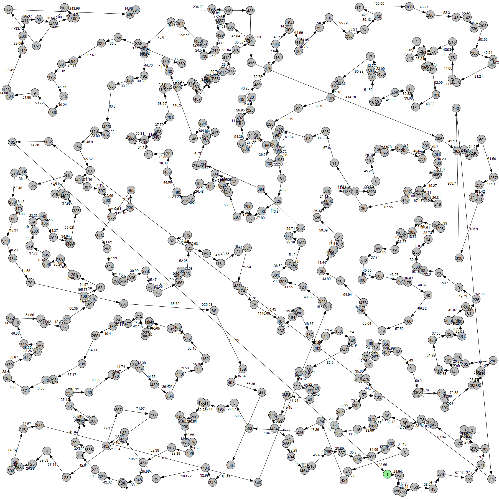
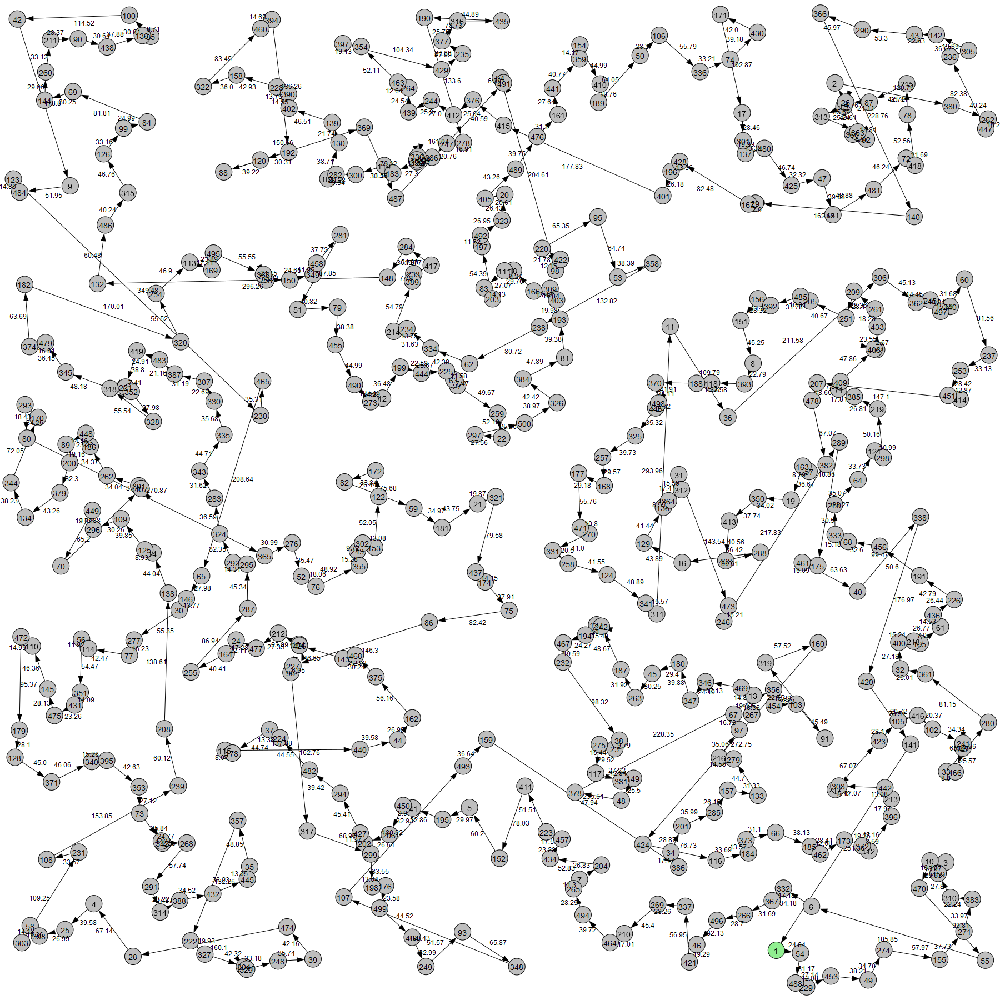
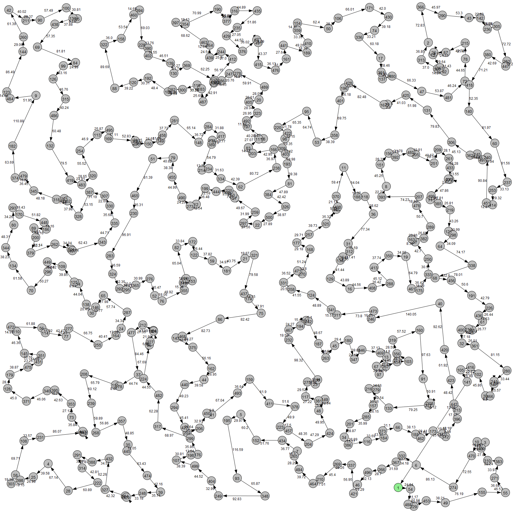

# Travelling Salesman Solver

The algorithms take the travelling destinations as a list of coordinates as a `.txt` file (see `instances/small.txt` as an example).

## Heuristics

Implements heuristics "Nearest-Neighbour" and "Double-Tree" to approximate solutions to the Travelling Salesman Problem in graph theory.

| Initial Solution (Nearest Neighbour)                                        | Initial Solution (Double-Tree)                                  |
| --------------------------------------------------------------------------- | --------------------------------------------------------------- |
|  |  |

## Improvements

The 2-opt Algorithm can improve an initial solution by iteratively changing to edges of the solution route.

| Initial Solution                                                | Improved by 2-opt                                          |
| --------------------------------------------------------------- | ---------------------------------------------------------- |
|  |  |

You can visualize the graph and subsequent route by running the `draw_g()` method in the `plot_graph.py` script.
